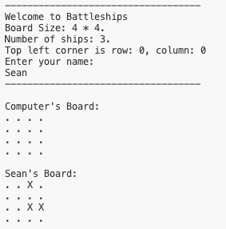

# Battleships

Battleships is a pyton terminal game shich runs in the Code Institue mock terminal on Heroku.
Users play against a computer to try and guess the location of the computer's ships before the computer finds theirs.
The board is 4 * 4 squares and contains 3 ships, each ships occupies 1 square
- the live link can be found here: <https://battlesean-e791976cdc64.herokuapp.com/>

## How to Play
In this version of the classic game, the player enetrs their name and two boards are randomly generated.
The player's name is displayed over their board and their ships are visible ('X'). The ships on the computer board remain invisible.
The player can then enter row and column coordinates to guess the location of the computer's ships.
The computer then guesses the coordinates of the player's ships.
The player can quit during the game or the game will end once either the player or the computer ships have been sunk.
The player is then asked of they would like to replay.

## Existing Features
- User inputs their name,
- Computer and Player boards are randomly generated,
- Computer board is invisible, Player board is visible.             

- Input validation:
  - guesses outside of range
  - invalid input
- Computer guesses on player board                  

- Input validation: 
  - can't guess same square twice             

- Ability to quit game before game ending              

- Ability to replay game when all ships sunk               

## Data Model
Board Class
- Attributes:
  - size: Represents the size of the game board.
  - board: Represents the actual game board, implemented as a 2D list.
  - num_ships: Represents the number of ships in the game.
  - ships: Represents the positions of the ships on the board.
- Methods:
  - __init__: Initializes the board with the specified size and number of ships.
  - print: Prints the current state of the board.
  - hide_ship: Hides the ships on the board, revealing only hits and misses.
  - make_guess: Allows a player to make a guess on the board.
  - random_guess: Generates a random guess for the computer player.

game_loop Function
- Manages the game loop where the player and computer take turns making guesses.
- Keeps track of guessed positions by both the player and the computer.
- Alternates between player and computer turns until one player sinks all ships or the player quits.
- Relies on the validate_coordinates function to ensure valid guesses by the player.

Helper Functions
- populate_board: Populates the game board with ships at random positions.
- validate_coordinates: Validates the coordinates input by the player to ensure they are within the bounds of the board and have not been guessed before.
- game: Initializes the game, sets up player and computer boards, populates boards with ships, and runs the game loop until one player wins or the user quits.

## Future Features
- Ability to have multiple players
- Ability to set the board size
- Ability to select number of ships
- Ability to select ship locations

## Testing
I have manually tested the project in the following ways:
- Passed code through PEP8 CI Linter with no errors
- Given invalid inputs: outside of range, strings and same input twice
- Tested in local terminal and and CI Heroku terminal

## Validator Testing
- PEP8 CI Python Linter
  - no errors returned, however, multiple lines too long but I couldn't change this as it affected the syntax of code.

## Deployment
- Steps for deployment
  - Fork or clone this repository
  - Create a new Heroku app
  - Set the buildpacks to Python and NodeJS in that order
  - Link the Heroku app to the repository
  - Click on Deploy

## Credits
 - Code Institue for deployment terminal
 - Code Institute Project 3 scope video
 - if not: <https://www.geeksforgeeks.org/python-if-with-not-operator/>
 - if in: <https://www.w3schools.com/python/gloss_python_check_if_set_item_exists.asp>
